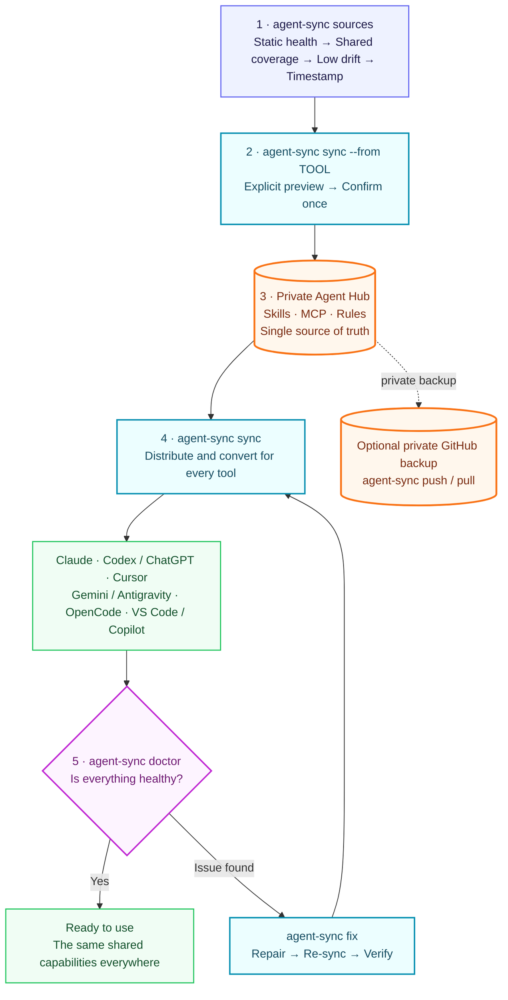

# agent-sync

**Cross-tool synchronizer for Agent Skills, MCP servers, and agent rules.**

This repository is the **tool only**. It does **not** contain anyone’s personal skills, MCP secrets, or private rules.

Your personal configuration belongs in a **separate private hub** (default `~/.config/agent-hub`).

Supported tools:

- Cursor
- Antigravity (Gemini)
- Claude Code
- Codex
- OpenCode
- VS Code GitHub Copilot

## Install

```bash
git clone https://github.com/LittlePeter52012/agent-sync.git ~/.local/share/agent-sync
ln -sf ~/.local/share/agent-sync/bin/agent-sync ~/.local/bin/agent-sync
```

## Quick start

If one Agent tool is already configured the way you want, ask Agent Sync to
rank the available sources, preview the recommended source, and then promote it:

```bash
agent-sync sources
agent-sync sync --from vscode --dry-run
agent-sync sync --from vscode
```

Supported sources are `vscode`, `cursor`, `antigravity`, `opencode`, `codex`,
and `claude`. `sources` is read-only: healthy configurations rank before broken
ones, shared-MCP coverage ranks first, lower tool-only drift ranks second,
top-level tools rank before profile replicas, and modification time is only a
final tie-breaker. Agent Sync never promotes a source automatically.

`sync --from` shows added, changed, removed, and unchanged MCP names before
asking for confirmation. It creates a minimal private Hub automatically on first
use, then distributes Skills, MCP servers, and Rules to all supported tools.

If you prefer to build the private Hub directly:

```bash
agent-sync init
# edit ~/.config/agent-hub/ ...
agent-sync sync
```

## How synchronization works



There are only three normal workflows:

```bash
agent-sync sync                         # Hub → every Agent
agent-sync sources                      # rank safe MCP source candidates
agent-sync sync --from vscode           # VS Code → Hub → every Agent
agent-sync fix                          # repair deterministic issues and verify
```

Use `--dry-run` to preview a source promotion without writing, or `--yes` for
intentional non-interactive use. `agent-sync all` remains an alias for the
original full Hub-to-tools workflow.

## Two-layer model

| Layer | What | Where | Visibility |
|-------|------|--------|------------|
| **agent-sync** (this repo) | Sync CLI + merge logic | `~/.local/share/agent-sync` | Public |
| **Personal hub** | Your skills / MCP / rules | `~/.config/agent-hub` | **Private** (your choice) |

### Privacy boundary

- The **public agent-sync repository** contains only the synchronizer, generic
  examples, tests, and the generic workflow diagram above.
- The **private Agent Hub** contains personal Skills, shared MCP definitions,
  Rules, the Skill whitelist, and retired shared-server names.
- Local credentials and machine-specific paths stay in environment variables or
  local Agent configurations; Hub definitions should use `${ENV}` placeholders.
- `agent-sync push` runs the privacy audit before staging or pushing Hub files.
  Normal `sync` never copies private Hub content into the public tool repository.

```text
~/.local/share/agent-sync/     ← tool (public)
~/.config/agent-hub/           ← YOUR configs (keep private)
    manifest.yaml
    skills/
    mcp/shared-servers.json
    rules/
```

## Commands

```bash
agent-sync init          # create hub from examples/
agent-sync sync          # Hub → skills + MCP + rules + verify
agent-sync sources       # rank local MCP configurations without changing them
agent-sync sync --from vscode --dry-run
agent-sync sync --from vscode # VS Code → Hub → all tools
agent-sync trace mcp NAME # show shared/retired/tool-only ownership and locations
agent-sync all           # backward-compatible alias for full Hub sync
agent-sync skills        # symlink whitelist skills
agent-sync mcp           # merge shared MCP (keeps tool-only servers)
agent-sync rules         # inject rules/*.md
agent-sync list          # coverage matrix
agent-sync verify        # structural verification
agent-sync verify --strict # structural verification + runtime doctor
agent-sync test
agent-sync status
agent-sync doctor        # local agent capabilities and sync-health report
agent-sync doctor --runtime # add bounded OpenCode/Claude MCP probes
agent-sync doctor --json # same report as safe, machine-readable JSON
agent-sync fix --dry-run # preview safe local repairs without writing
agent-sync fix           # sync missing coverage and normalize synced rules
agent-sync update        # pull latest agent-sync tool from GitHub
agent-sync update --sync # update tool + re-sync hub to all AI tools
agent-sync update --hub  # also pull personal hub
agent-sync pull          # pull personal hub only
agent-sync audit         # privacy audit (tokens, PII, repo visibility)
agent-sync push -m "msg" # commit/push the personal hub (if it is a git repo)
```

`doctor` is local and read-only. It reports installed agent surfaces, configured
model/provider names, skill and shared-MCP coverage, tool-only MCP executable
health, optional CLI-backed Skill dependencies, retired MCP residue, plugin/MCP
scope drift, and duplicate synced rules.
`doctor --runtime` adds bounded OpenCode and Claude CLI probes. Raw command
output is discarded after status parsing. Reports never print MCP values,
tokens, private configuration paths, cookies, or account/subscription
information. The default bounds are 30 seconds for OpenCode and 90 seconds for
Claude. Override them with `AGENT_SYNC_RUNTIME_TIMEOUT_OPENCODE` and
`AGENT_SYNC_RUNTIME_TIMEOUT_CLAUDE`, or set
`AGENT_SYNC_RUNTIME_TIMEOUT` for both.

`fix` is intentionally narrow: it repairs missing sync coverage, removes retired
Hub-managed MCP names, and normalizes managed rule blocks. Tool-only MCP servers
remain untouched. For shared MCP names, Hub command, URL, transport, and normal
arguments are authoritative; existing local secrets and machine-specific
absolute paths are preserved.

For VS Code, `agent-sync mcp` merges shared MCP servers into the default user
configuration and every existing VS Code Profile. Profile-specific MCP files
are separate in current VS Code releases, so `agent-sync doctor` reports each
Profile's coverage individually.

### Adopting a configuration from an Agent

`sync --from` promotes only MCP configuration. Shared Skills are symlinks to
the private Hub already, while Rules stay Hub-owned so tool-specific prompts do
not accidentally spread everywhere.

The selected source becomes authoritative for the shared MCP set. Missing old
shared names are recorded in `mcp/retired-servers.json` and safely removed from
other tools on the next `sync`; servers that were never Hub-managed remain
local. An empty, unreadable, or ambiguous source is rejected before any write.
VS Code automatically selects its only non-builtin MCP Profile; when several
Profiles qualify, choose one explicitly with `vscode:<profile-id>`.

Do not choose a source by file modification time alone: a recently touched
configuration may still contain a retired or broken MCP. Use `agent-sync
sources`, inspect `agent-sync sync --from TOOL --dry-run`, and promote the
source explicitly.

### Optional tool-scope policy

The private Hub can audit native plugin ownership and intentional tool-only MCP
servers without installing, uninstalling, or removing anything. Put a policy at
`policies/tool-scopes.json`:

```json
{
  "skills": {
    "example-cli-skill": {
      "required_commands": ["example-cli"]
    }
  },
  "plugins": {
    "opencode": {
      "required": ["example-opencode-plugin"]
    },
    "codex": {
      "forbidden": ["example-plugin@example-marketplace"]
    }
  },
  "mcp": {
    "codex": {
      "allowed_tool_only": ["native-loopback"],
      "required_tool_only": ["native-loopback"]
    },
    "cursor": {
      "allowed_tool_only": ["editor-native-server"]
    }
  }
}
```

`skills.<name>.required_commands` makes Doctor verify that a shared
CLI-backed Skill is usable, not merely linked. Skill names must also appear in
`manifest.yaml`. Bare commands are resolved through `PATH`; executable paths
are checked directly. The check is read-only: Agent Sync never installs or
updates the CLI. Prefer this pattern over adding a duplicate shared MCP when
the Agents can already invoke the local command through a Skill.

`allowed_tool_only` rejects accidental MCP drift while preserving the names
listed for that Agent. `required_tool_only` also reports when a native
integration disappears. Matching is case-insensitive. Supported keys are
`antigravity`, `cursor`, `claude`, `opencode`, `codex`, and `vscode`.

The ownership rule is:

| Capability | Source of truth | Agent Sync behavior |
|---|---|---|
| Shared Skill | Hub manifest and `skills/` | Symlink to every supported Agent |
| CLI used by a shared Skill | Local package manager or pinned binary; optional Hub health policy | Audit availability only |
| Shared MCP | Hub `mcp/shared-servers.json` | Merge into every supported Agent |
| Tool-only MCP | Its native Agent config | Preserve and audit only |
| Native plugin/extension | Product plugin manager | Never synchronize |

`doctor` only reports scope drift. Each product's native plugin manager remains
authoritative, and `agent-sync fix` never removes tool-only MCP servers.

A locally launched CLI or MCP can still call a cloud service. Record execution
location and data destination separately in the private Hub runbook instead of
assuming that every local process is offline.

### Auto-update (optional)

Skills use **symlinks** — editing a shared Skill from any linked tool updates
the Hub-backed file immediately.

For the **tool itself** and **hub git backup**:

```bash
agent-sync update          # pull tool updates (--ff-only, safe)
agent-sync update --sync   # pull + re-run skills/mcp/rules
```

Optional in `manifest.yaml` (opt-in):

```yaml
auto_update_check: true   # check once/day when you run agent-sync all
auto_update_apply: false  # set true to auto-pull (default off for safety)
```

Environment:

- `AGENT_HUB_ROOT` — personal hub (default `~/.config/agent-hub`)
- `AGENT_SYNC_HOME` — tool install path (auto-detected)

## Personal hub layout

```text
~/.config/agent-hub/
  manifest.yaml              # skills whitelist
  skills/<name>/SKILL.md
  mcp/shared-servers.json    # shared MCP (use ${ENV} placeholders)
  mcp/retired-servers.json   # shared MCP names intentionally removed
  policies/tool-scopes.json  # optional plugin and tool-only MCP scope audit
  rules/*.md                 # injected into CLAUDE.md / AGENTS.md / GEMINI.md / Copilot
```

`manifest.yaml` example:

```yaml
skills:
  - my-skill
```

`mcp/shared-servers.json` can contain local stdio servers and remote HTTP
servers:

```json
{
  "mcpServers": {
    "miro-mcp": {
      "type": "http",
      "url": "https://mcp.miro.com"
    }
  }
}
```

For Claude Code, `agent-sync mcp` uses the official `claude mcp add` CLI with
user scope instead of editing Claude's private config files directly.

Normal `sync` does not silently pull or push GitHub. To back up your private Hub:

```bash
agent-sync push -m "promote preferred MCP configuration"
```

On another machine, run `agent-sync pull` followed by `agent-sync sync`.

## Secrets

- Put **placeholders** like `${MINERU_API_TOKEN}` in `mcp/shared-servers.json`.
- On merge, agent-sync resolves values from the process environment or existing local Agent configs.
- Never commit real tokens to a **public** repository.
- Your **private** hub may contain secrets if you accept that risk; prefer placeholders + local donors.

## License

MIT
