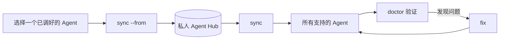

# 指定来源提升与全量同步实施计划

> **For agentic workers:** REQUIRED SUB-SKILL: Use superpowers:subagent-driven-development (recommended) or superpowers:executing-plans to implement this plan task-by-task. Steps use checkbox (`- [ ]`) syntax for tracking.

**目标：** 增加 `sync`、`sync --from <工具>` 和完整 MCP 收敛能力，使 Hub 可以向全部工具分发，也可以采用指定工具的 MCP 配置后重新分发。

**架构：** 新增一个无第三方依赖的 Python 提升器，将各工具原生 MCP 配置转换为 Hub 标准格式，脱敏后原子写入；另一个小型脚本根据 Hub 的退役名称清理过去共享、现在已删除的 MCP。现有 Skills、MCP、Rules 同步器仍负责实际分发，CLI 只编排流程。

**技术栈：** Bash 3.2、Python 3 标准库、`unittest`、JSON/TOML、GitHub Mermaid。

## 全局约束

- 反向提升只处理 MCP；Skills 保持 Hub 软链接；Rules 只允许 Hub 向外分发。
- 来源必须由 `--from` 明确指定，禁止用修改时间自动推断。
- 公开输出和公开仓库不得包含密钥、私人 Hub 内容、个人路径或个人仓库地址。
- 写 Hub 前必须备份；空来源、损坏来源和 Profile 歧义必须在任何写入前失败。
- 删除只作用于 Hub 过去管理过的 MCP 名称，不能删除工具专属 MCP。
- `all` 保持为 `sync` 的兼容别名，现有细分命令不能失效。

---

### 任务 1：实现来源发现、标准化和脱敏预览

**文件：**
- 新建：`scripts/promote-mcp.py`
- 新建：`tests/test_promote_mcp.py`

**接口：**
- 输入：`promote-mcp.py --source <名称> --hub <目录> [--home <目录>] [--dry-run] [--yes]`
- 输出：终端仅显示来源标识和 `新增/修改/删除/不变` 的 MCP 名称。
- 写入：`<hub>/mcp/shared-servers.json`、`<hub>/mcp/retired-servers.json` 和
  `<hub>/.sync-backups/<时间戳>/mcp/`。

- [ ] **步骤 1：先写来源提升失败测试**

在 `tests/test_promote_mcp.py` 创建临时 HOME 和 Hub，覆盖以下测试：

- `test_vscode_dry_run_reports_changes_without_writing`
- `test_vscode_profile_ambiguity_requires_explicit_id`
- `test_empty_source_cannot_replace_hub`
- `test_secret_values_are_never_printed_or_written`
- `test_existing_placeholders_survive_promotion`
- `test_removed_shared_names_become_retired`

样例中放入字符串 `SECRET_MUST_NOT_LEAK`，断言它不出现在 stdout、stderr、标准
Hub 文件和退役文件中；同时断言 `--dry-run` 前后 Hub 文件字节完全一致。

- [ ] **步骤 2：运行测试并确认按预期失败**

运行：

```bash
python3 -m unittest tests/test_promote_mcp.py -v
```

预期：因 `scripts/promote-mcp.py` 尚不存在而失败。

- [ ] **步骤 3：实现最小提升器**

在 `scripts/promote-mcp.py` 实现以下清晰边界：

- `locate_source(source: str, home: Path) -> tuple[str, Path, str]`：解析来源别名和路径。
- `load_source(source: str, home: Path) -> dict[str, dict[str, object]]`：读取并验证服务器集合。
- `normalize_server(kind: str, cfg: dict[str, object]) -> dict[str, object]`：转换为 Hub 格式。
- `sanitize_server(name: str, cfg: dict[str, object], old: dict[str, object]) -> dict[str, object]`：保留或生成占位符。
- `build_plan(old: dict[str, object], new: dict[str, object]) -> dict[str, list[str]]`：计算四类名称差异。
- `apply_promotion(hub: Path, servers: dict[str, object], plan: dict[str, list[str]]) -> None`：备份并原子写入。

JSON 来源键映射固定为：Cursor/Antigravity/Claude 使用 `mcpServers`，VS Code
使用 `servers`，OpenCode 使用 `mcp`。Codex 使用标准库 `tomllib` 读取
`mcp_servers`。OpenCode 的本地 `command` 数组转换为标准 `command` 加 `args`，
远程 `type: remote` 转换为 `type: http`。

对 `env` 和 `headers` 中的具体字符串值：优先沿用旧 Hub 同字段的 `${变量}`；否则
分别生成 `${原环境变量名}` 和 `${AGENT_SYNC_<服务器>_<请求头>}`。终端计划只显示
排序后的服务器名称。写入使用同目录临时文件加 `Path.replace()`，备份写入
`.sync-backups/<时间戳>/mcp/`。

- [ ] **步骤 4：运行聚焦测试并确认通过**

运行：

```bash
python3 -m unittest tests/test_promote_mcp.py -v
```

预期：全部通过，输出中没有样例密钥。

- [ ] **步骤 5：提交提升引擎**

```bash
git add scripts/promote-mcp.py tests/test_promote_mcp.py
git commit -m "feat: promote MCP config from selected agent"
```

### 任务 2：让退役 MCP 在全部目标安全收敛

**文件：**
- 新建：`scripts/prune-retired-mcp.py`
- 修改：`scripts/sync-mcp.sh`
- 修改：`scripts/sync-mcp-claude.py`
- 修改：`tests/test_promote_mcp.py`

**接口：**
- 输入：标准退役文件和目标配置文件。
- 输出：删除数量和 MCP 名称；不得输出配置值。
- 保证：只删除退役列表中的名称，保留其他本地服务器。

- [ ] **步骤 1：先写删除收敛失败测试**

新增测试，构造 `retired=["old-shared"]`，目标同时包含 `old-shared` 和
`tool-only`。分别覆盖 Cursor 形状、VS Code 形状、OpenCode 形状和 Codex TOML，
断言前者删除、后者保留；为 Claude 使用假 CLI，断言调用
`claude mcp remove --scope user old-shared`。

- [ ] **步骤 2：运行测试并确认按预期失败**

```bash
python3 -m unittest tests/test_promote_mcp.py -v
```

预期：因退役清理脚本不存在或同步器尚未调用它而失败。

- [ ] **步骤 3：实现退役清理并接入现有同步器**

`prune-retired-mcp.py` 接口：

- `prune_json(path: Path, retired: set[str]) -> int`：清理 JSON 目标并返回删除数量。
- `prune_codex(path: Path, retired: set[str]) -> int`：清理 Codex TOML 并返回删除数量。

JSON 按大小写不敏感名称删除 `mcpServers`、`servers` 或 `mcp` 中的键。Codex
只删除匹配 `[mcp_servers.<名称>]` 及其紧随的子表，保留其他 TOML 内容。
`sync-mcp.sh` 在 merge 前对默认目标和每个 VS Code Profile 执行清理；Claude
脚本在添加前调用官方 CLI 删除退役名称。重新加入共享集合的名称不会保留在退役文件中。

- [ ] **步骤 4：运行聚焦测试并确认通过**

```bash
python3 -m unittest tests/test_promote_mcp.py -v
```

- [ ] **步骤 5：提交安全删除能力**

```bash
git add scripts/prune-retired-mcp.py scripts/sync-mcp.sh scripts/sync-mcp-claude.py tests/test_promote_mcp.py
git commit -m "feat: converge retired shared MCP servers"
```

### 任务 3：接入三个核心命令和首次使用流程

**文件：**
- 修改：`bin/agent-sync`
- 修改：`scripts/sync-skills.sh`
- 修改：`tests/test_promote_mcp.py`

**接口：**
- `agent-sync sync`
- `agent-sync sync --from <工具> [--dry-run|--yes]`
- `agent-sync all` 兼容调用 `sync` 的下发路径。

- [ ] **步骤 1：先写 CLI 失败测试**

新增测试断言：

- `test_sync_is_the_full_hub_to_agents_workflow`
- `test_sync_from_runs_promotion_then_full_distribution`
- `test_sync_from_bootstraps_minimal_hub`
- `test_unknown_source_and_option_fail_without_writes`

假 HOME 中提供可执行的假 `claude`；首次使用断言生成的 `manifest.yaml` 使用空
Skills 列表而不是示例 Skill 或示例 Rule。

- [ ] **步骤 2：运行 CLI 测试并确认失败**

```bash
python3 -m unittest tests/test_promote_mcp.py -v
```

预期：`sync` 分支尚不存在。

- [ ] **步骤 3：实现最小 CLI 编排**

在 `bin/agent-sync` 提取一个复用函数：

```bash
run_full_sync() {
    bash "$SCRIPTS/sync-skills.sh" --method=symlink
    bash "$SCRIPTS/sync-mcp.sh"
    bash "$SCRIPTS/sync-rules.sh"
    bash "$SCRIPTS/verify-all.sh"
}
```

`sync` 无来源时要求现有 Hub 后执行该函数；有来源时先调用提升器，`--dry-run`
成功后直接结束，实际写入成功后调用全量同步并执行 doctor。`all` 调用同一函数。
首次提升创建 `manifest.yaml`、`skills/`、`mcp/`、`rules/` 最小结构。
`sync-skills.sh` 对空白名单打印“无共享 Skills，跳过”并成功退出。

- [ ] **步骤 4：运行 CLI 测试和旧测试**

```bash
python3 -m unittest tests/test_promote_mcp.py tests/test_agent_doctor.py -v
```

- [ ] **步骤 5：提交 CLI 工作流**

```bash
git add bin/agent-sync scripts/sync-skills.sh tests/test_promote_mcp.py
git commit -m "feat: add one-command source sync workflow"
```

### 任务 4：强化可用性检查和 fix 闭环

**文件：**
- 修改：`scripts/agent-doctor.py`
- 修改：`scripts/verify-all.sh`
- 修改：`tests/test_agent_doctor.py`

**接口：**
- doctor 增加不含值的 `unresolved placeholder` 和 `missing executable` Findings。
- verify 检查每个目标实际包含全部共享 MCP 名称，而不只检查配置文件存在。

- [ ] **步骤 1：先写诊断失败测试**

在临时 Hub 放入 `${MISSING_TOKEN}` 和不存在的命令 `missing-mcp-command`，断言
doctor 只显示变量名和命令名，不显示任何具体值。为缺少共享名称的目标写 verify
失败用例。

- [ ] **步骤 2：运行测试并确认失败**

```bash
python3 -m unittest tests/test_agent_doctor.py -v
```

- [ ] **步骤 3：实现安全诊断和名称覆盖验证**

解析 Hub 标准配置，只检查占位符名称和 stdio `command`。普通命令使用
`shutil.which()`，绝对路径使用 `Path.exists()`。HTTP MCP 不做可执行文件检查。
verify 复用当前 JSON/TOML 名称读取逻辑，VS Code 同时检查全部现有 Profile。
`fix` 继续调用全量同步器，因此自动重试缺失项和退役清理。

- [ ] **步骤 4：运行诊断和完整单元测试**

```bash
python3 -m unittest discover -s tests -v
```

- [ ] **步骤 5：提交诊断增强**

```bash
git add scripts/agent-doctor.py scripts/verify-all.sh tests/test_agent_doctor.py
git commit -m "feat: verify synchronized MCP usability"
```

### 任务 5：更新公开说明和漂亮的 GitHub 流程图

**文件：**
- 修改：`README.md`

**接口：**
- README 提供首次采用、日常下发、反向提升、修复、远端 Hub 备份五个最短示例。
- 使用 GitHub 原生 Mermaid 渲染，不提交包含个人内容的截图或配置文件。

- [ ] **步骤 1：更新 README 命令和流程图**

加入下面的数据流，并使用 `classDef` 区分来源、Hub、分发和检查节点：



README 明确说明普通 `sync` 不会自动访问 GitHub；远端备份继续使用 `push`，其他
机器使用 `pull` 后再 `sync`。

- [ ] **步骤 2：检查 README 和公开隐私边界**

```bash
git diff --check
./bin/agent-sync audit
```

- [ ] **步骤 3：提交公开文档**

```bash
git add README.md docs/superpowers/specs/2026-07-13-source-promotion-sync-design.md docs/superpowers/plans/2026-07-13-source-promotion-sync.md
git commit -m "docs: explain source promotion sync workflow"
```

### 任务 6：真实配置验证、私人 Hub 说明和发布

**文件：**
- 修改（私人仓库）：`~/.config/agent-hub/README.md`
- 不提交公开仓库：私人 Hub 的 MCP、Skills、Rules 和任何本机配置值。

- [ ] **步骤 1：执行完整公开仓库验证**

```bash
bash -n bin/agent-sync scripts/*.sh
python3 -m unittest discover -s tests -v
./bin/agent-sync test
./bin/agent-sync audit
git diff --check
```

预期：所有命令退出码为 0，测试和隐私审计无失败。

- [ ] **步骤 2：在真实配置上先预演再执行**

```bash
agent-sync sync --from vscode --dry-run
agent-sync sync --from vscode --yes
agent-sync doctor
```

如果 VS Code 存在多个非内置 Profile，则使用预演输出中的明确 Profile 标识。
不得自动重载正在编辑的 VS Code 窗口。

- [ ] **步骤 3：只更新私人 Hub 的通用使用说明**

将私人 README 中的日常命令改为 `sync`、`sync --from` 和 `fix`。保留 Hub 中
已有的未提交 MCP、术语表、短语库和规则改动，不重排、不覆盖、不自动提交无关文件。

- [ ] **步骤 4：分别检查两个仓库的待提交范围**

```bash
git -C ~/.config/agent-hub status -sb
git status -sb
./bin/agent-sync audit
```

公开仓库只包含工具代码、测试、通用文档和 Mermaid；私人仓库提交前逐项检查现有
改动，确认没有密钥明文。

- [ ] **步骤 5：推送公开分支、合并并更新本机 main**

推送 `agent/source-sync`，创建或更新 PR，确认隐私审计与测试结果后合并到 `main`。
随后将 `/Users/slavatang/.local/share/agent-sync` 快进到远端 `main`，再运行一次
`agent-sync doctor`。

- [ ] **步骤 6：更新私人 Hub**

只提交经过审查且属于用户意图的 Hub 文件。已有用户改动不得被丢弃；如果隐私审计
发现具体值，则先改为占位符，再提交并推送私人仓库。
